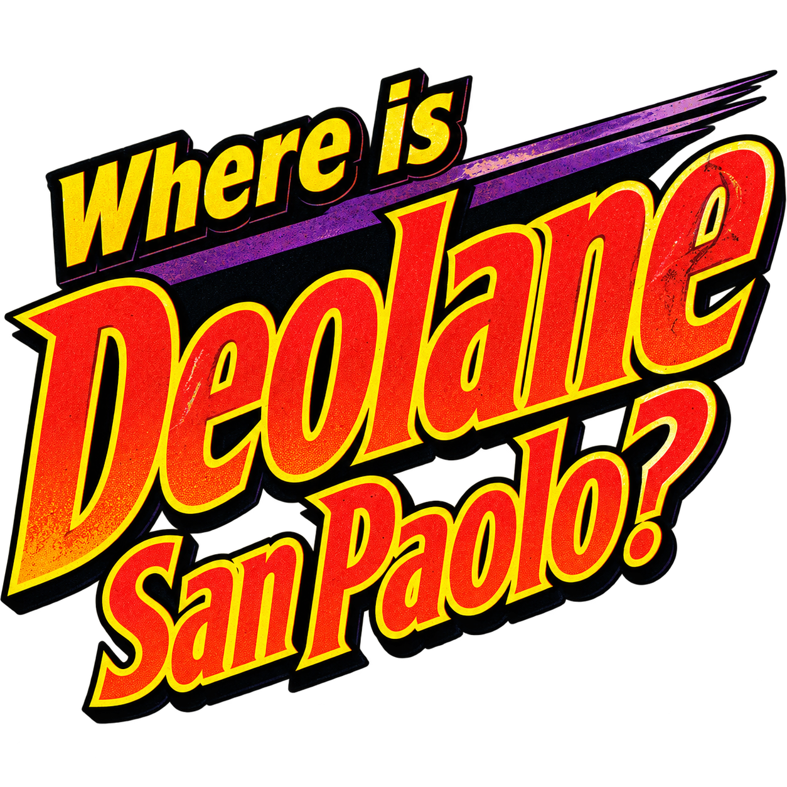

<p align="center">
  
</p>

<p align="center">
  <strong>O MUNDO ESTÁ EM ALERTA. A T.C.C. ESTÁ EM TODA PARTE. E O RELÓGIO NÃO PARA.</strong>
</p>

<p align="center">
  <a href="https://mreaggle.github.io/DeolaneSanPaolo/"><strong>▶ JOGUE AGORA NO SEU COMPUTADOR OU CELULAR ◀</strong></a>
</p>

---

## A grande caçada mundial chegou ao seu computador

Um patrimônio desapareceu. Uma testemunha fala demais — ou de menos. Um avião parte para o outro lado do planeta. Por trás de cada pista está a **T.C.C. — Tríade Chapa-Coco**, uma organização de criminosos espalhada pelo mundo e comandada pela inconfundível Deolane San Paolo.

Você acaba de entrar para a **Agência Federal**. Sua missão é seguir o rastro por aeroportos, mercados, hotéis, portos e monumentos; separar fatos de despistes; identificar o capanga responsável; emitir o mandado correto; e chegar ao esconderijo antes que as 120 horas se esgotem.

Não espere setas luminosas, respostas prontas ou caminhos seguros. Neste jogo, uma passagem comprada para a cidade errada custa tempo. Um detalhe ignorado pode inocentar o culpado. E encontrar o esconderijo sem um mandado válido ainda significa voltar para casa de mãos vazias.

## Eles roubaram o impossível. Você vai recuperar tudo.

- Viaje por **30 cidades** em uma rede internacional de rotas, pistas geográficas e falsos destinos.
- Investigue locais, interrogue testemunhas e descubra para onde a T.C.C. fugiu.
- Consulte o computador da Agência, filtre características e emita um mandado que realmente corresponda ao suspeito.
- Enfrente casos progressivamente mais longos até o décimo quarto e decisivo confronto com **Deolane San Paolo**.
- Veja aviões, perseguições, fugas e capangas ganharem vida em animações de pixel art acompanhadas por trilha e efeitos próprios.
- Continue sua carreira no mesmo aparelho: o progresso fica salvo localmente, sem conta e sem servidor.

## Uma aventura perdida de 1991 — construída para a web de hoje

**Deolane San Paolo** preserva o ritmo, a densidade de informação e as limitações deliberadas dos grandes jogos de investigação para DOS. A tela inteira segue uma composição lógica de 640×400, ampliada com pixels nítidos em monitores modernos e ajustada sem desmontar o painel clássico em celulares no modo paisagem.

Use mouse, toque ou teclado. No PC, a superfície pode ocupar 1280×800 ou mais; no celular, gire o aparelho e acione **TELA CHEIA**. Atalhos durante a investigação: `V`/`1` para rotas, `P`/`2` para viajar, `B`/`3` para busca local e `C`/`4` para o P.C. de mandados.

## Dossiê técnico

O jogo é uma aplicação estática feita com TypeScript, Svelte 5, Vite e CSS. O motor de casos, rotas, pistas, mandados, relógio e progressão funciona separado da interface e possui testes automatizados. O save versionado usa apenas `localStorage`; nenhuma chave de API ou chamada de IA é enviada ao navegador.

```bash
npm install
npm run dev
npm test
npm run test:e2e
npm run build
```

As artes de produção são arquivos locais catalogados em [ASSET_MANIFEST.md](ASSET_MANIFEST.md). O material gerado durante o desenvolvimento usa referências do período apenas para gramática visual — pixels duros, paleta limitada, contornos e dithering — sem copiar personagens ou telas. A pesquisa histórica e seus limites estão documentados em [ORIGINAL_GAME_ANALYSIS.md](ORIGINAL_GAME_ANALYSIS.md).

A interface usa localmente a fonte bitmap **Silkscreen**, sob a SIL Open Font License 1.1. Ficção, personagens, T.C.C., Agência Federal, textos, código e artes finais pertencem a este projeto independente.

---

<p align="center">
  <strong>DEVELOPED &amp; POWERED-BY <a href="https://instagram.com/mreaggle">@Mreaggle</a></strong><br>
  <em>Você tem 120 horas. A próxima pista já está esfriando.</em>
</p>
